Hi, I’m Jens (/jɛns/), and you may know me from [meiert.com](https://meiert.com/en/), [Frontend Dogma](https://frontenddogma.com/), [WebGlossary.info](https://webglossary.info/), any of [my books](https://www.goodreads.com/author/list/13623828.Jens_Oliver_Meiert), or maybe one of my small projects (like [The World’s Highest Website](https://worlds-highest-website.com/), or something that I’ve [archived](https://mirrors.meiert.org/)).

<!-- Metrics -->

<!-- dōteki -->

<!-- blog start -->
## From [My Blog](https://meiert.com/en/)

- [How I Run Eleventy (It’s Complicated?)](https://meiert.com/en/blog/how-i-run-eleventy/) · 2025-04-18
- [5 Ways to Reduce HTML File Size on Your Website, Step 0](https://meiert.com/en/blog/reduce-html-file-size/) · 2025-04-16
- [Empathy](https://meiert.com/en/blog/empathy/) · 2025-04-06
- [New Book: Tara (A Utopia)](https://meiert.com/en/blog/tara/) · 2025-04-03
- [Micro-Scrum](https://meiert.com/en/blog/micro-scrum/) · 2025-04-01
- [Markup Languages](https://meiert.com/en/blog/markup-languages/) · 2025-03-28
- [Where to Put a Mouse or Trackpad](https://meiert.com/en/blog/mouse-or-trackpad-placement/) · 2025-03-23
- [Where Frontend Dogma Gets Its News From](https://meiert.com/en/blog/frontend-dogma-news/) · 2025-03-20
- [Utilization](https://meiert.com/en/blog/utilization/) · 2025-03-18
- [Prisoner’s Dilemma](https://meiert.com/en/blog/prisoners-dilemma/) · 2025-03-16
<!-- blog end -->

