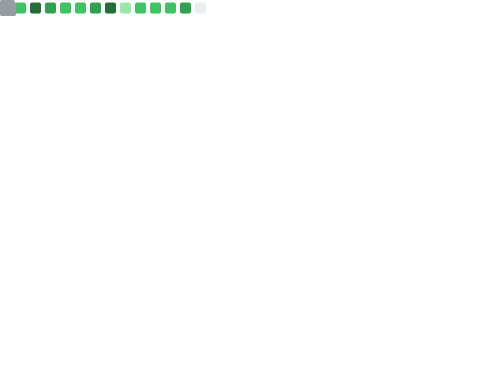
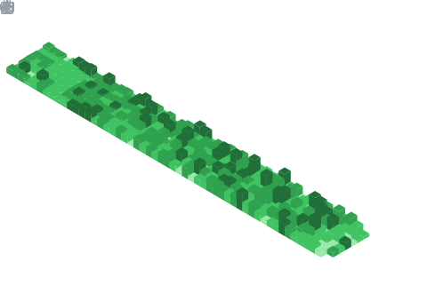

Hi, I’m Jens (/jɛns/), and you may know me from [meiert.com](https://meiert.com/), [Frontend Dogma](https://frontenddogma.com/), [WebGlossary.info](https://webglossary.info/), any of [my books](https://www.goodreads.com/author/list/13623828.Jens_Oliver_Meiert), an initiative like [CSS Naked Day](https://css-naked-day.org/) or an open-source project like [HTML Minifier Next](https://github.com/j9t/html-minifier-next) or an experiment like [The World’s Highest Website](https://worlds-highest-website.com/)—or something else, like something I’ve [archived](https://mirrors.meiert.org/).

<!-- Metrics -->

<!-- dōteki -->

<!-- blog start -->
## From [My Blog](https://meiert.com/)

- [There Is No Elite Unless It Serves the People and the Environment](https://meiert.com/blog/there-is-no-elite/) · 2026-04-18
- [AI Will Never Be Ethical or Safe](https://meiert.com/blog/ai-ethics-and-safety/) · 2026-04-13
- [A Simple Model to Address Work Performance Issues](https://meiert.com/blog/performance-model/) · 2026-04-08
- [There Is No “Wrong” in CSS](https://meiert.com/blog/wrong-css/) · 2026-04-05
- [Releasing Searcher, a Configurable, Privacy-Minded Chromium Extension to Trigger Random Searches](https://meiert.com/blog/searcher/) · 2026-03-30
- [“Conflict”](https://meiert.com/blog/conflict/) · 2026-03-28
- [HTML Minifier Next: Zero-Config Mode, SVG Minification With SVGO, Even Faster](https://meiert.com/blog/html-minifier-next-updates-4/) · 2026-03-25
- [The Web Development Glossary 4K](https://meiert.com/blog/the-web-development-glossary-4k/) · 2026-03-23
- [Releasing .htaccess Punk—a Quick Helper to Check Redirects in .htaccess Files](https://meiert.com/blog/htaccess-punk/) · 2026-03-18
- [Astro: How to Set Up More Powerful HTML Minification (in 31 Seconds)](https://meiert.com/blog/astro-html-minification/) · 2026-03-16
<!-- blog end -->

