Hi, I’m Jens (/jɛns/), and you may know me from [meiert.com](https://meiert.com/), [Frontend Dogma](https://frontenddogma.com/), [WebGlossary.info](https://webglossary.info/), any of [my books](https://www.goodreads.com/author/list/13623828.Jens_Oliver_Meiert), an initiative like [CSS Naked Day](https://css-naked-day.org/) or an open-source project like [HTML Minifier Next](https://github.com/j9t/html-minifier-next) or an experiment like [The World’s Highest Website](https://worlds-highest-website.com/)—or something else, like something I’ve [archived](https://mirrors.meiert.org/).

<!-- Metrics -->

<!-- dōteki -->

<!-- blog start -->
## From [My Blog](https://meiert.com/)

- [Website Optimization Measures, Part XXXIV](https://meiert.com/blog/optimization-measures-34/) · 2025-11-17
- [A Suggestion for Your Community Terms and Policies](https://meiert.com/blog/community-terms/) · 2025-11-12
- [3 User-Friendly Technical Ways to Respond to Genocidistan](https://meiert.com/blog/genocidistan/) · 2025-11-08
- [Now Available: “On Web Development II”!](https://meiert.com/blog/on-web-development-2/) · 2025-11-05
- [HTML Minifier Next: Now With Lightning CSS](https://meiert.com/blog/html-minifier-next-and-lightning-css/) · 2025-11-04
- [The Economy Is Important Because](https://meiert.com/blog/the-economy/) · 2025-11-01
- [HTML Minifier Next: Improved Minification, More Comprehensive CLI, Clearer Docs](https://meiert.com/blog/html-minifier-next-updates/) · 2025-10-28
- [Nostr: How to Generate Your Keys Locally](https://meiert.com/blog/nostr-keys/) · 2025-10-26
- [Everyone Should Earn the Same](https://meiert.com/blog/earn-the-same/) · 2025-10-25
- [Millionaires and Billionaires](https://meiert.com/blog/millionaires-and-billionaires/) · 2025-10-18
<!-- blog end -->

