Hi, I’m Jens (/jɛns/), and you may know me from [meiert.com](https://meiert.com/en/), [Frontend Dogma](https://frontenddogma.com/), [WebGlossary.info](https://webglossary.info/), any of [my books](https://www.goodreads.com/author/list/13623828.Jens_Oliver_Meiert), or maybe one of my small projects (like [The World’s Highest Website](https://worlds-highest-website.com/), or something that I’ve [archived](https://mirrors.meiert.org/)).

<!-- Metrics -->

<!-- dōteki -->

<!-- blog start -->
## From [My Blog](https://meiert.com/en/)

- [Where Has All the Valid HTML Gone](https://meiert.com/en/blog/where-has-all-the-valid-html-gone/) · 2024-11-21
- [What I Learned About That Difficult Childhood](https://meiert.com/en/blog/that-difficult-childhood/) · 2024-11-17
- [1 + 2 Engineering Team Priorities](https://meiert.com/en/blog/engineering-team-priorities/) · 2024-11-14
- [8 AI Tips for Web Developers (and Their Careers)](https://meiert.com/en/blog/ai-tips-for-web-developers/) · 2024-11-12
- [When You Are Rich](https://meiert.com/en/blog/when-you-are-rich/) · 2024-11-10
- [3 Things to Note About Democracy](https://meiert.com/en/blog/democracy/) · 2024-11-06
- [Everyone Can Set You Up for Failure, Not Everyone Sets You Up for Success](https://meiert.com/en/blog/set-up-for-success/) · 2024-11-02
- [The Image Compression Challenge (Donating Money for Excess-Free Projects)](https://meiert.com/en/blog/the-image-compression-challenge/) · 2024-10-30
- [Website Optimization Measures, Part XXVII](https://meiert.com/en/blog/optimization-measures-27/) · 2024-10-24
- [Results = ƒ(Competence × Time)](https://meiert.com/en/blog/results-competence-time/) · 2024-10-23
<!-- blog end -->

